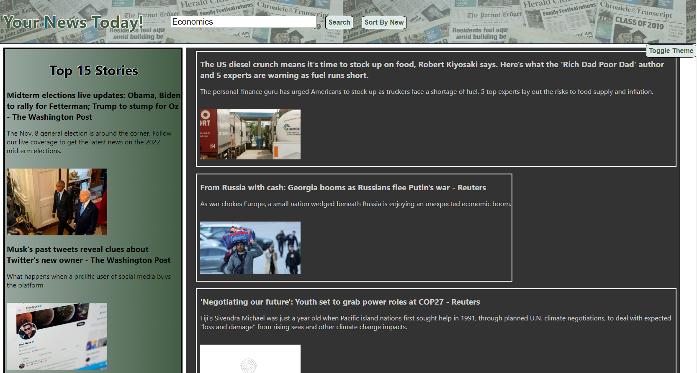

# Your News Today

## 🖥️ Github URL 🖥️
## https://github.com/AlexPap1/News-API
 

## Deployed Application
## https://alexpap1.github.io/News-API/
 

## AlexPap1
## https://github.com/AlexPap1/
 

## Demonstration
## https://drive.google.com/file/d/1dwFObjqIUsEtyq6fCDsdJ5CLZ3_C-sGs/view
 

## 🖊️ Description 🖊️
 

This repo is a serverless React.JS application which uses a news api to display current events. Your News Today allows users to search for news articles in groups of 15, and can view the original articles by clicking the thumbnails. Also displayed are the top 15 news stories in the US in current time. Users are able to sort search results by relevance (default) or by publish dats (starting by new). A useContext react hook is also used to toggle a dark/light theme for a better viewing experience. The repo uses multiple compoenents including the header, footer, and sidebar. The footer contains a contact link to send an email to the developer. **API calls on the deployed app are unsuccessful due to requests from the browser not allowed on the Developer plan, except from localhost - error code 426. (Please see the following: https://stackoverflow.com/questions/62123382/issue-with-newsapi-org-api-and-jquery). 
 

## 📜 Table of Contents 📜
 

* [Installations](#⬇️-installations-⬇️)
* [Usage](#⚙️-usage-⚙️)

* [License](#👮-license-👮)

* [Contributors](#🤝-contributors-🤝)
* [Tests](#👾-tests-👾)
* [Questions?](#🤔-questions-🤔)
 

## ⬇️ Installations ⬇️
 

This application uses moment ver 2.29.4 and react-moment ver 1.1.2
 

## ⚙️ Usage ⚙️
 

Upon cloning the repo, users should install dependencies and run npm start within the news-api terminal
 

## 🤝 Contributors 🤝
 

AlexPap1
 

## 👾 Tests 👾
 

 

## 👮 License 👮
    
    The following Repo has been licensed under  by the user.
 

## 🤔 Questions 🤔
 

* Have any additional questions? Check out my github profile AlexPap1 at https://github.com/AlexPap1/

* And feel free to ask additional questions by reaching [my email](mailto:arpappagallo@gmail.com).
 

Made with ❤️ and Thank you for viewing 🤝

